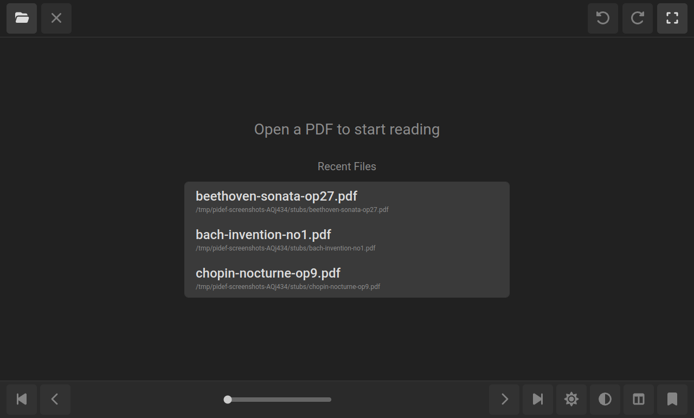
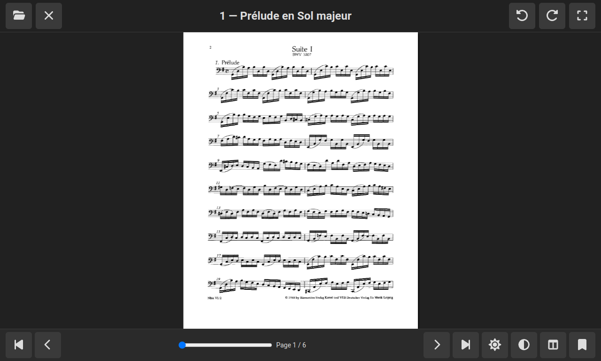
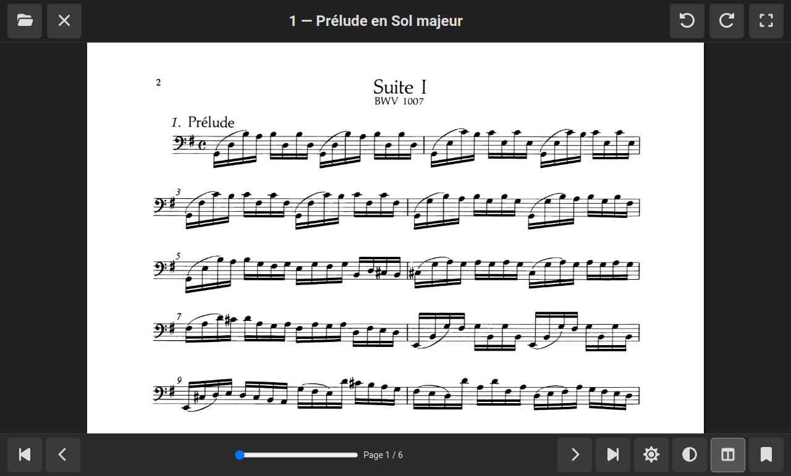
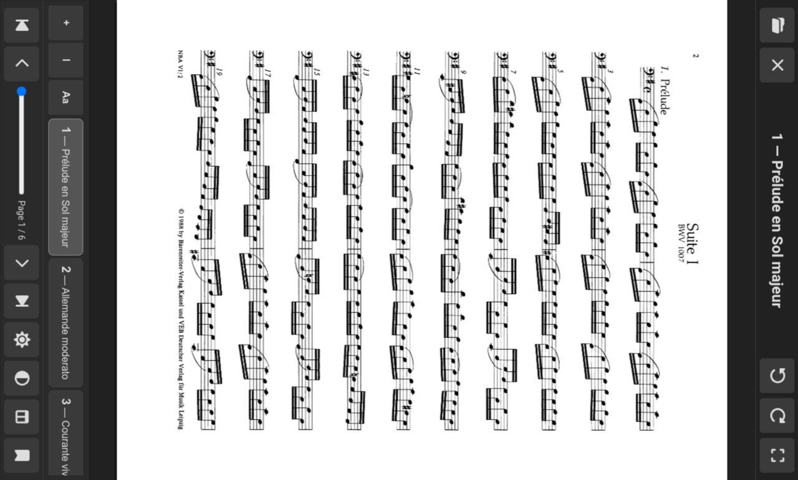
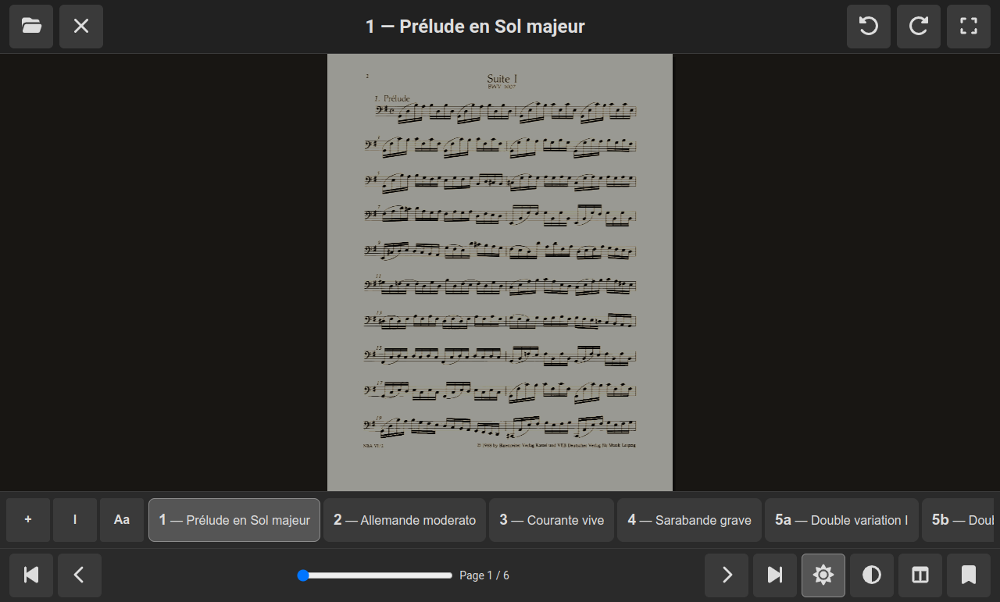
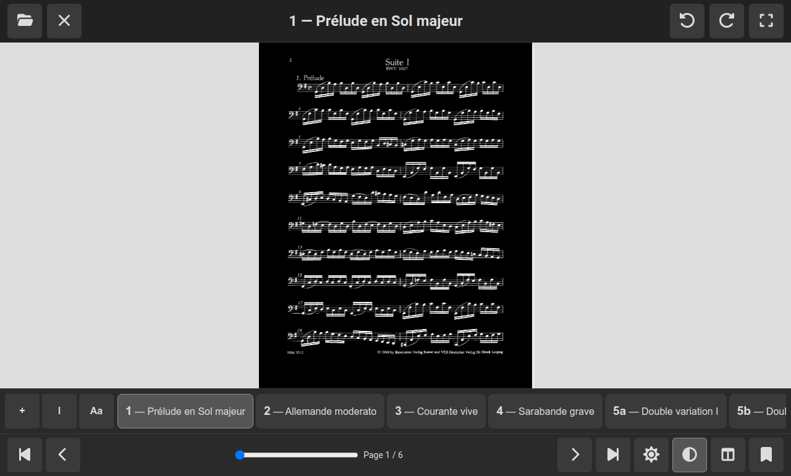
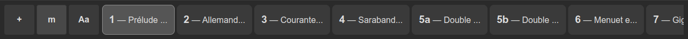
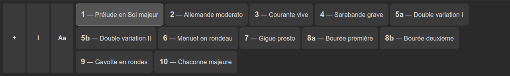
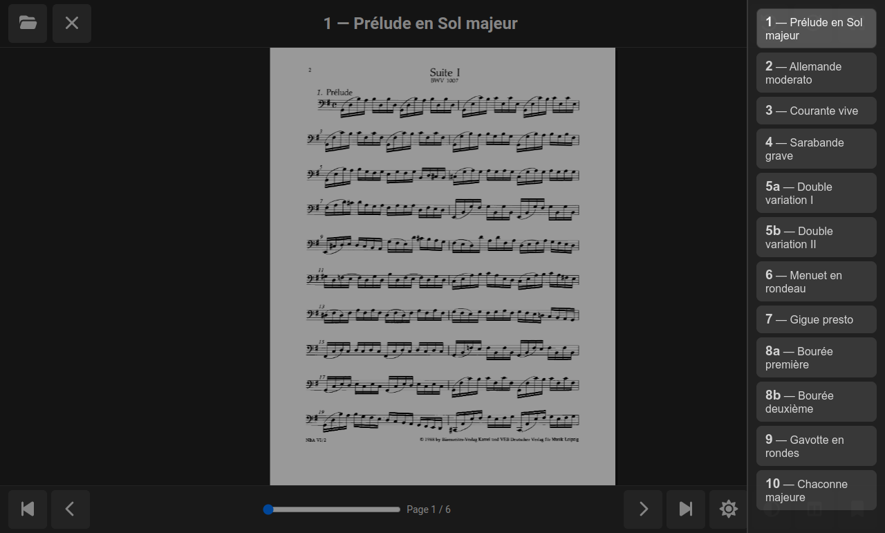

# pidef

A minimal Electron PDF reader built for **touchscreen performance**. Designed specifically for musicians who need reliable, responsive page turning on stage or during practice without the bloat of general-purpose document readers.


## Why pidef?

When performing music, you need instant page turns with zero lag. Existing Ubuntu PDF readers—whether desktop or mobile—introduce frustrating delays, imprecise touch targets, or hover-dependent interfaces that don't work with fingers. They're built for mouse-first workflows with touchscreen bolted on as an afterthought.

pidef flips that: it's **touch-first from the ground up**, optimized for Ubuntu touchscreen laptops and tablets. If you're standing with a sheet music reader or lead sheets in hand, you need gestures that work reliably under pressure, buttons you can hit with a finger, and animations that feel responsive—not sluggish.

## Features

- **Fast swipe navigation** — Left/right gestures turn pages with natural snap-back feedback
- **Touch-optimized UI** — All buttons are minimum 44×44px (preferably 48×48px) for reliable finger operation
- **Full-screen mode** — Maximize reading area with one tap; minimize UI clutter during performance
- **Smooth 220ms animations** — Page transitions feel responsive without motion fatigue over long practice sessions
- **Responsive feedback** — Visual snap-back (150ms) when you almost swipe a page; no hover states
- **UI rotation** — Manually rotate the display 0°/90°/180°/270° via a toolbar button; works around Ubuntu laptops that handle automatic screen rotation poorly
- **Keyboard fallback** — Arrow keys, Page Up/Down, and Space for alternative input
- **Minimal codebase** — ~500 lines of TypeScript; easy to understand and modify

## Screenshots

| Welcome screen | PDF open |
|:---:|:---:|
|  |  |

| Half-page mode | Rotated 90° |
|:---:|:---:|
|  |  |

| Sepia filter | Inverted |
|:---:|:---:|
|  |  |

**Bookmark bar** (small / medium / large width):







## Quick Start

```bash
npm install
npm start
```

To open a PDF file directly:

```bash
npm run build && npx electron dist/main.js path/to/file.pdf
```

Or use **Ctrl+O** to open a file dialog inside the app.

## Navigation

| Input | Action |
|-------|--------|
| Swipe left or right | Next / previous page |
| Right arrow, Page Down, Space | Next page |
| Left arrow, Page Up, Backspace | Previous page |
| F11 or tap fullscreen button | Toggle fullscreen |
| Escape | Exit fullscreen |
| Ctrl+O | Open file dialog |
| Rotate button (toolbar) | Cycle display rotation: 0° → 90° → 180° → 270° |

## Use Case: Sheet Music & Lead Sheets

pidef is ideal for:
- **Musicians performing on stage** — Hands-free page turns; full-screen display maximizes music visibility
- **Practice sessions** — Swipe through charts without reaching for a mouse or clicking small buttons
- **Touchscreen laptops** — Optimized for Ubuntu devices with touch input; works great on tablets too
- **Lead sheets and chord charts** — Fast, responsive navigation keeps you focused on playing
- **Portrait/landscape flexibility** — Manually rotate the UI when your device's auto-rotation misbehaves (common on some Ubuntu laptops)

## System Requirements

- Node.js 18+
- Electron (installed via npm)
- Works on Linux, macOS, and Windows

## Architecture

React + TypeScript frontend, Electron main/preload for native integration:

- **`src/main.ts`** — Electron main process; handles window creation, file dialogs, and IPC
- **`src/preload.ts`** — Secure context bridge exposing the `window.pidef` API
- **`src/AppProvider.tsx`** — React context with all app state (page, bookmarks, settings)
- **`src/hooks/usePdfEngine.ts`** — RAF animation loop, pointer/gesture handling, PDF rendering
- **`src/components/`** — UI components: Toolbar, NavBar, CanvasContainer, BookmarkBar, etc.
- **`src/lib/`** — Pure utilities: easing, pdf-geometry, bookmark-utils
- **`src/styles.scss`** — Touch-optimized styling

The PDF engine uses `pdfjs-dist` with `OffscreenCanvas` for smooth 60fps rendering. Animation state machine: `idle` → `dragging` → `snap` or `animating`.

## Configuration

Key animation tuning (in `src/hooks/usePdfEngine.ts`):
- **`ANIM_MS`** (120 ms) — Page slide duration
- **`SNAP_MS`** (80 ms) — Snap-back duration when gesture doesn't commit
- **`THRESHOLD_PX`** (40 px) — Minimum swipe distance to turn a page
- **`SLIDE_PX`** (40 px) — Incoming page preview slide distance

## License

MIT
